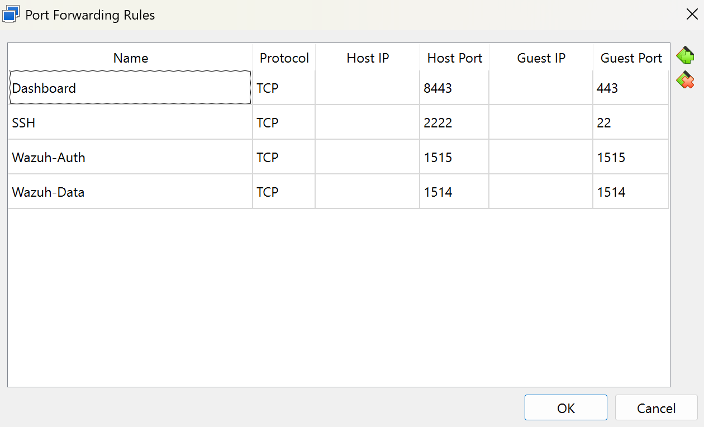
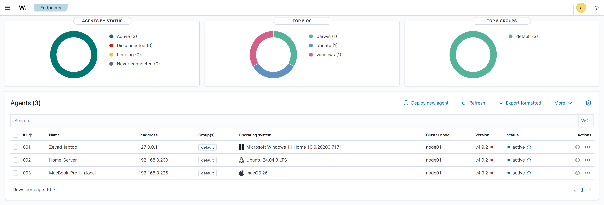
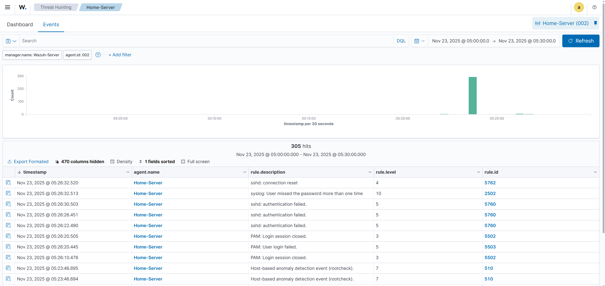
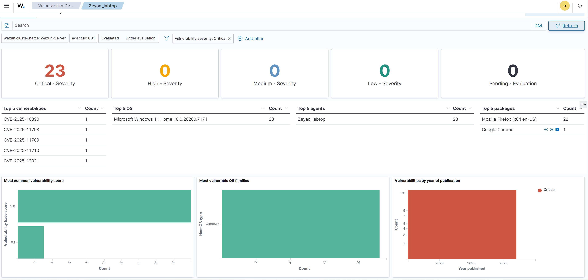

# Building-Home-SOC-Lab-Wazuh
A centralized Home SOC Lab using Wazuh SIEM to monitor a hybrid fleet (Windows, Linux ARM, macOS). Features custom network engineering (NAT/Port Forwarding) to bridge physical endpoints with virtualized infrastructure.
#  Building a Centralized Home SOC Lab with Wazuh

##  Project Overview
This project documents the end-to-end deployment of a **Security Operations Center (SOC)** using **Wazuh SIEM** within a home network environment. The primary objective was to achieve full observability and threat detection across a **hybrid fleet** of endpoints, including **Windows 11**, **Linux (Raspberry Pi ARM64)**, and **macOS (Apple Silicon)**.

The project highlights the engineering challenges faced regarding hardware architecture (ARM vs. x86) and the implementation of custom networking solutions to bridge virtualized environments with physical hardware.

---

##  Architecture & Network Design

### The Challenge: Hardware Compatibility
The initial deployment strategy focused on a **Raspberry Pi 5** using Docker. However, significant compatibility issues with Wazuh container images on the **ARM64 architecture** led to system instability.

### The Pivot: Virtualization & Network Engineering
I pivoted to a virtualization approach to leverage the stability of x86 architecture and the resources of the main host.
1.  Deployed **Wazuh Server** on a virtualized **Ubuntu Server 24.04** within **VirtualBox**.
2.  **The Network Bridge:** Since the VM operates behind a NAT network (isolated from physical devices), I engineered a **Port Forwarding** solution to allow external agents to communicate with the internal server via the Host IP.

**Network Topology:**

[Physical Network]
      |
      +--- [Windows 11 Host] (The Gateway)
      |         |
      |         +--- [VirtualBox NAT Engine]
      |                   |
      |                   +--- [Ubuntu VM - Wazuh Server]
      |                        (Ingesting logs via forwarded ports)
      |
      +--- [Raspberry Pi 5] (Linux Agent) --> Sends logs to Windows Host IP
      |
      +--- [MacBook Pro] (macOS Agent) --> Sends logs to Windows Host IP
##  Technical Implementation

### 1. Infrastructure Setup
* **Hypervisor:** VirtualBox.
* **Server OS:** Ubuntu Server 24.04 LTS.
* **Resources:** 8GB RAM, 4 vCPUs (Allocated from a 32GB Host).

### 2. Networking Configuration (Port Forwarding)
To bypass the NAT isolation, specific tunnels were configured on the Host machine to forward traffic to the VM:

| Service | Host Port | Guest Port | Protocol | Purpose |
| :--- | :--- | :--- | :--- | :--- |
| **Agent Data** | `1514` | `1514` | TCP | Log ingestion from endpoints |
| **Enrollment** | `1515` | `1515` | TCP | New agent registration |
| **Dashboard** | `8443` | `443` | TCP | Web Interface Access |
| **SSH** | `2222` | `22` | TCP | Remote Server Management |

*(VirtualBox Port Forwarding Configuration)*

### 3. Agent Deployment
Successfully deployed and connected agents across diverse operating systems:
* **Windows 11:** Connected via `127.0.0.1` (Loopback).
* **Raspberry Pi (ARM64):** Configured `ossec.conf` to target the Host IP.
* **macOS (Apple Silicon):** Granted **Full Disk Access** to enable system log collection.

*(Wazuh Dashboard showing active agents)*

##  Threat Hunting Simulation (Proof of Concept)

To validate the detection capabilities, I conducted a live **SSH Brute-Force** attack simulation against the Raspberry Pi server.

**The Scenario:**
1.  **Attack:** Automated login attempts using invalid credentials targeting port 22.
2.  **Detection:** Wazuh correlated the events and triggered:
    * `Rule ID 5760` (Authentication Failed).
    * `Rule ID 5503` (PAM User Login Failed).
3.  **Escalation:** The system identified the pattern and flagged it as a potential brute-force attempt.

*(Threat Hunting Dashboard displaying the attack alerts)*

---

##  Vulnerability Management & Remediation

Upon enabling the **Vulnerability Detector** module, the initial scan revealed significant risks on the Windows endpoint:
* **Finding:** **23 Critical Vulnerabilities** (CVEs) detected.
* **Root Cause:** An outdated and unused installation of **Mozilla Firefox**.
* **Remediation:** Executed an **Attack Surface Reduction** strategy by uninstalling the vulnerable software, effectively bringing the critical count to zero.

*(Vulnerability Scan Report)*

---

##  Key Takeaways
* **Strategic Problem Solving:** Pivoting from a failing hardware deployment to a stable virtualized infrastructure.
* **Network Engineering:** Practical mastery of NAT, Port Forwarding, and Firewalls to bridge isolated networks.
* **Unified Visibility:** Achieving a "Single Pane of Glass" view for heterogeneous systems (Windows, Linux, macOS).

---
*Project executed by Zeyad AlRashed*
